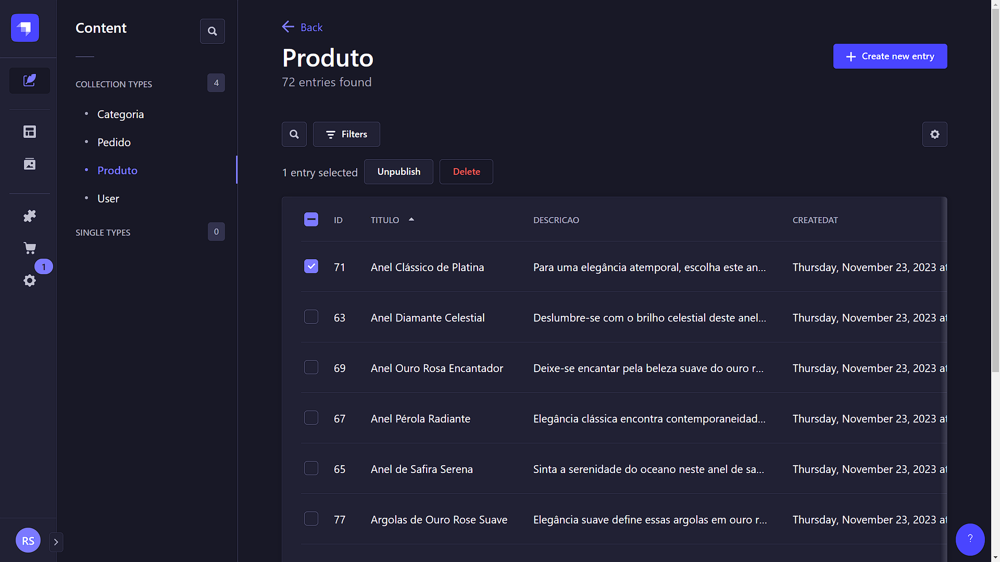

# Acme Ecommerce Server


Imagem da listagem de produtos dentro do painel CMS do projeto.

## 📌 Índice

- [Sobre este projeto](#-sobre-este-projeto)
- [Rotas](#-rotas)
- [Instalação](#-instalação)
- [Como contribuir](#-como-contribuir)
- [Licença](#-licença)

## 💻 Sobre este projeto

Esse é o back-end da aplicação [acme-ecommerce-web](https://github.com/rodrigosuelli/acme-ecommerce-web).

Temos aqui uma API RESTful + painel CMS (Content Management System) construídos com [Strapi](https://strapi.io). Foram feitas algumas personalizações com [Node.js](https://nodejs.org/en/) para adequar o projeto às regras de negócio. Como banco de dados, foi usado [PostgreSLQ](https://www.postgresql.org/). Para o armazenamento das imagens dos produtos, foi utilizado o serviço de armazenamento de objetos [Firebase Storage](https://firebase.google.com/docs/storage). E para o envio de emails de 'esqueci minha senha', foi feita a integração do [Strapi](https://strapi.io) com o serviço de envio de emails [SendGrid](https://sendgrid.com/en-us).

Através do painel CMS, é possível fazer o gerenciamento das categorias, produtos, pedidos e usuários. O armazenamento das imagens dos produtos é feito automaticamente no Firebase Storage após cadastrar um novo produto. Através da API REST, podemos fazer as mesmas ações disponíveis no painel CMS, porém de forma programática. Assim, podemos fornecer dados para o nosso frontend e também utilizar a autenticação e fazer o envio de emails de 'esqueci minha senha'.

[Strapi](https://strapi.io) é uma ferramenta que permite, através da sua interface gráfica, criar o backend completo da sua aplicação. Ele oferece uma API REST e um painel CMS para gerenciar as entidades do seu banco de dados. O Strapi fornece um sistema de autenticação local e uma fácil integração com diversos bancos de dados, além de suportar serviços de terceiros para autenticação e armazenamento de objetos, incluindo a opção de armazenar localmente.

## 📃 Rotas

### Urls base do Strapi

URL base: <http://localhost:1337>. Serve apenas para verificar se o sistema está rodando.

URL base do painel CMS: <http://localhost:1337/admin>. Acesso ao painel administrativo CMS.

URL base da API: <http://localhost:1337/api>. Rota base para utilização da API REST.

### Rotas base da API

Rota base de autenticação: <http://localhost:1337/api/auth>.

Rota base de categorias: <http://localhost:1337/api/categorias>.

Rota base de produtos: <http://localhost:1337/api/produtos>.

Rota base de pedidos: <http://localhost:1337/api/pedidos>.

Rota base de usuarios: <http://localhost:1337/api/users>.

Acesse a [documentação da API REST](https://docs.strapi.io/dev-docs/api/rest) para aprender a utilizar as rotas da API.

## 🚀 Instalação

### Pré-requisitos

- Ter [**Git**](https://git-scm.com/) para clonar o projeto.
- Ter [**Node.js**](https://nodejs.org/en/) instalado.
- Ter um gerenciador de pacotes como [**NPM**](https://www.npmjs.com/get-npm) ou [**Yarn**](https://classic.yarnpkg.com/en/) para instalar as dependências do projeto.
- Ter o [**PostgreSLQ**](https://www.postgresql.org/) instalado.

### Clonando o Repositório

```bash
git clone https://github.com/rodrigosuelli/acme-ecommerce-server.git

cd acme-ecommerce-server
```

### Instalando as dependências

```bash
$ npm install

# ou

$ yarn
```

### Copiando o arquivo `.env`

Faça uma copia do arquivo .env.example e a renomeie para .env

```bash
# Faz uma copia do arquivo .env.example e renomeia para .env
$ cp .env.example .env
```

No arquivo `.env` insira os dados do banco de dados que será usado e os `secrets` necessários para rodar a aplicação.

### Comandos para rodar o projeto

#### `develop`

Start your Strapi application with autoReload enabled. [Learn more](https://docs.strapi.io/dev-docs/cli#strapi-develop)

```bash
npm run develop
# or
yarn develop
```

#### `start`

Start your Strapi application with autoReload disabled. [Learn more](https://docs.strapi.io/dev-docs/cli#strapi-start)

```bash
npm run start
# or
yarn start
```

### `build`

Build your admin panel. [Learn more](https://docs.strapi.io/dev-docs/cli#strapi-build)

```bash
npm run build
# or
yarn build
```

Mais informações sobre como rodar o projeto no arquivo [Run-Strapi.md](.github/GettingStarted.md)

## 🤔 Como contribuir

1. Faça um fork desse repositório
2. Faça um clone do seu fork (`git clone url-do-seu-fork && cd acme-ecommerce-server`)
3. Crie uma branch com sua feature ou correção de bugs (`git checkout -b minha-branch`)
4. Faça commit das suas alterações (`git commit -m 'feature/bugfix: minhas alterações'`)
5. Faça push para a sua branch (`git push origin minha-branch`)
6. Abra sua Pull Request no repositório que você fez o fork

## 📝 Licença

Este projeto está licenciado sob a licença [MIT](./LICENSE).
